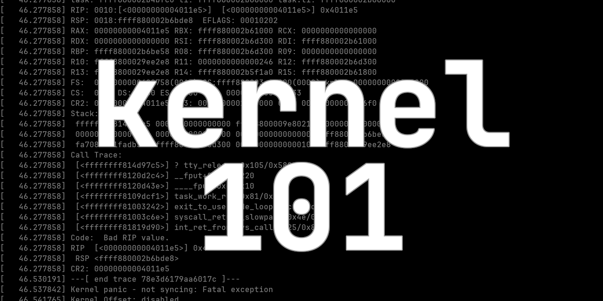

<h1 align="center">
  
   
  kernel 101 | Kernel kırmanın temellerini öğrenin
</h1>

Size (`x86_64`) kernel kırmanın temellerini öğretecek
ve biraz pratik yapmanızı sağlayacak küçük bir rehber.

### Başlarken...
İşte bilmeniz gereken bazı şeyler ve ön gereksinimler:

- Farklı pratikleri çalıştırmak adına KVM/QEMU kurulumu
- Genel GNU/Linux tabanlı sistem bilgisi
- Genel bellek yönetimi ve C ve ASM bilgisi

Bunun yanı sıra, bellek zaafiyetleri ve nasıl kötüye kullanılabileceklerini
bilmeniz gerekiyor, bu bilgiye sahip değilseniz endişelenmeyin,
[birileri bunun için de bir kaynak yazmış :)](https://github.com/ngn13/o101).

Bu rehber aynı zamanda farklı CTF challengeları üzerinden ilerleyeceğinden,
büyük ihtimalle CTF'ler hakkında da bilginiz olması gerekecek.

### Bir sorun mu var?
Eğer yardıma ihtiyaç duyarsanız, herhangi bir sorun yaşarsanız
bir [issue oluşturmaktan çekinmeyin](https://github.com/ngn13/kernel-101/issues).

Ayrıca [doğrudan bana](mailto:ngn@ngn.tf) da ulaşabilirsiniz.

### Hazır mısın?
Herşey tamamsa, aşağıdaki linkleri kullanarak macerana başlayabilirsin.

İyi eğlenceler!

| Bölüm                     | Açıklama                                                                      | Link                                                   |
| ------------------------- | ----------------------------------------------------------------------------- | ------------------------------------------------------ |
| Giriş                     | Kernel hakkında genel bilgi edinin                                            | [kernel.md](docs/intro.md)                             |
| Kernel Advantures Part 2  | Sistem çağrılarını anlayın ve zaafiyetli bir sistem çağrısını kötüye kullanın | [kernel_adventures_2..md](docs/kernel_adventures_2.md) |
| Babydriver (SMEP yok)     | UAF zafiyetini kötüye kullanarak ret2usr yöntemi ile root alın                | [babydriver_no_smep.md](docs/babydriver_no_smep.md)    |
| Babydriver                | ROP kullanarak SMEP'i bypass edin                                             | [babydriver.md](docs/babydriver.md)                    |
